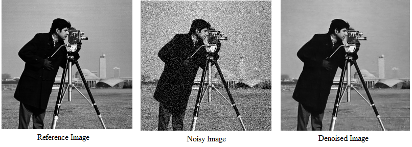
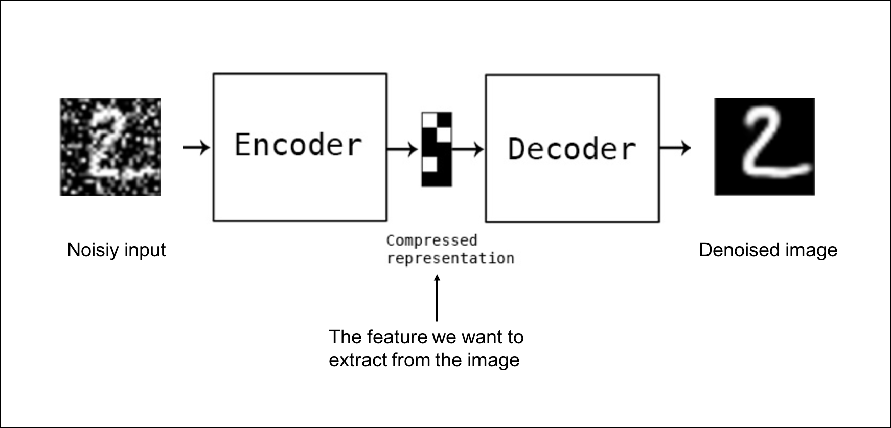

# Animation_Software_Engineering
# Neural Denoiser  

## Abstract

Neural Denoiser is a class of machine learning algorithms that use supervised and unsupervised learning to reduce noise in images or videos. A light transport technique with low sampling is used in the visual effects industry to reconstruct image sequences. Denoising an image has been a classic problem for decades, and neural networks have been helpful to the field as they have developed rapidly. They can, however, be used only in limited instances due to the difficulty in obtaining large quantities of pairs of noisy-clean images for monitoring. There are many sources of noise that complicate image denoising such as Gaussian, impulse, salt, pepper, and speckle noises. In the past, multiple attempts have been made to train image-denoising models with noisy images, but these approaches failed due to a lack of effective network training, information loss, or reliance on noise modeling. The purpose of this report is to train an algorithm that aims to eliminate image noise. This model will be trained using the MNIST_Fashion dataset.

## Detailed Description

Image denoising is an essential component of image processing which received overwhelming interest in the last decade. As per Ilesanmi et al. (2021) image denoising has become more important as a result of the increasing production of images taken in poor lighting conditions. Pang et al. (2021) say, besides serving as a fundamental component of many image recovery methods, image denoising is a significant problem in its own right. The noise in an image could be expressed as follows:

y = x + n,

Where y represents the noise, x denotes the noise-free image for recovery, and n stands for measurement noise. There are many ways to define the noise n, but the most common one is to consider the instance drawn from some distribution. Recent years have seen rapid growth in deep neural network-based image denoising. Zhang et al., (2016)  designed DnCNN to denoise images by combining convolutional neural networks and residual learning. The DnCNN algorithm outperforms traditional denoisers by a large margin when supervised by a noisy-clean paired image. As per Huang et al., (2021) these models require a huge amount of noisy-clean data for training and it is extremely exigent and exorbitant to gather a large amount of data for training. This is one of the limits of supervised denoisers. This paper aims to develop a method for denoising digital photographs that recognizes noise statistics and noise formation in low-light images by using supervised learning.

Source: gofastresearch.com

### Datasets
#### Smartphone Image Denoising Dataset (SIDD)

Abdelhamed et al., (2018) state that smartphone cameras have taken over DSLRs and point-and-shoots in the last decade. Compared to DSLRs, Images from smartphones have visibly more noise due to their small apertures and sensors. Although smartphone image denoising is a current research topic, no denoising dataset with high-quality ground truth for real noise-distorted smartphone images exists. The Smartphone Image Denoising Dataset (SIDD) is a collection of more than 30,000 noisy pictures taken by smartphones in 10 scenarios with various exemplary smartphone cameras in five different lighting scenarios. To determine the patterns and statistics of image noise, some researchers utilized this dataset as a testing ground for various denoising techniques.

#### FashionMNIST

The Fashion-MNIST dataset is a dataset of images containing various articles of clothing, such as shirts, trousers, and sneakers. It was created as a more challenging alternative to the commonly used MNIST dataset, which contains images of handwritten digits. Each image in the Fashion-MNIST dataset is 28x28 pixels in size and is labeled with one of 10 possible classes, corresponding to different types of clothing. (Xiao et al., 2017)

#### RENOIR

Anaya et al., (2018) introduced pixel and intensity-aligned clean images along with actual low-light noise-distorted images for the first time. It has 120 scenes represented by around 500 photos. Scientists could use the dataset to study low-light digital camera noise formation and statistics or to train and test image-denoising algorithms. Denoising algorithms must adjust their internal parameters to accommodate different levels of noise within a dataset since the images have different levels of noise.

### Arcitecture Proposal

#### Denoising Autoencoders

A denoising autoencoder (DAE) is a type of autoencoder neural network that is trained to reconstruct the original input from a corrupted version of it.

The main idea behind this is that by training the network to reconstruct the original input from a noisy version of it, the network will learn to robustly identify the underlying features of the data, even when the data is corrupted by noise. The DAE architecture is similar to a standard autoencoder, consisting of an encoder and a decoder, but with an additional layer to add noise to the input before it is passed through the encoder. The input is then passed through the encoder to produce a bottleneck representation, which is then passed through the decoder to reconstruct the original input. The network is trained to minimize the difference between the original input and the reconstructed output. (Vincent et al.,2010) 

#### ResNet

In their paper, He et al., (2015) introduced the ResNet deep learning model, one of the most well-known deep learning models. Feng (2022) says, despite its popularity, ResNet does have some disadvantages, including the need for weeks of training and its impossibility in real-world applications.

Source: Deep Residual Learning for Image Recognition (He et al., 2015)

As the building block of their network, the residual block was used by the scientists. The input of a particular residual block passes via both the weight layer and the identity shortcut during training, or else, only the identity shortcut is used. At training time, each layer is randomly dropped, according to its "survival probability". Each block is re-calibrated based on its survival probability during training time and kept active during testing (Feng., 2022). The likelihood that each layer will survive was calculated using a linear decay rule. In experiments, performance is improved when a 110-layer ResNet is trained with stochastic depth while reducing training time dramatically compared with training a 110-layer ResNet with a constant depth.

## References
#### 1. Ilesanmi, A.E., Ilesanmi, T.O.: Methods for image denoising using convolutional neural network: a review. 2021, AIS 2179–2198. Available from: https://link.springer.com/article/10.1007/s40747-021-00428-4#citeas [Accessed 16 November 2022].

#### 2. Tongyao Pang., 2021. Recorrupted-to-Recorrupted: Unsupervised Deep Learning for Image Denoising [Online]. In: Huan Zheng, Yuhui Quan, Hui Ji., eds. Proceedings of the IEEE/CVF Conference on Computer Vision and Pattern Recognition (CVPR), 2021, pp. 2043-2052. Available from: https://openaccess.thecvf.com/content/CVPR2021/html/Pang_Recorrupted-to-Recorrupted_Unsupervised_Deep_Learning_for_Image_Denoising_CVPR_2021_paper.html [Accessed 16 November 2022].

#### 3. Kai Zhang., 2016. Beyond a Gaussian Denoiser: Residual Learning of Deep CNN for Image Denoising [Online]. In:  Wangmeng Zuo, Yunjin Chen, Deyu Meng, Lei Zhang., eds. Computer Vision and Pattern Recognition (CVPR), 2016. Available from: https://arxiv.org/abs/1608.03981 [Accessed 16 November 2022].

#### 4. Tao Huang., 2021. Neighbor2Neighbor: Self-Supervised Denoising from Single Noisy Images [Online]. In: Songjiang Li, Xu Jia, Huchuan Lu, Jianzhuang Liu., eds. Computer Vision and Pattern Recognition (CVPR), 2021. Available from: https://arxiv.org/abs/2101.02824 [Accessed 16 November 2022].

#### 5. Abdelrahman Abdelhamed, Lin S., Brown M. S. 2018. "A High-Quality Denoising Dataset for Smartphone Cameras", [Online]. eds. IEEE Computer Vision and Pattern Recognition (CVPR), 2018. Available from: https://www.eecs.yorku.ca/~kamel/sidd/index.php [Accessed 17 November 2022].

#### 6. J. Anaya, A. Barbu., 2018. RENOIR - A Dataset for Real Low-Light Image Noise Reduction. Journal of Visual Comm. and Image Rep. [Online] 51(2), 144-154. Available from: https://arxiv.org/abs/1409.8230 [Accessed 17 November 2022].

#### 7. Kaiming He., 2015. Deep Residual Learning for Image Recognition. [Online]. In: Xiangyu Zhang, Shaoqing Ren, Jian Sun., eds. Computer Vision and Pattern Recognition (CVPR), 2015. Available from: https://arxiv.org/abs/1512.03385 [Accessed 17 November 2022].

#### 8. Zijian Feng., 2022. An Overview of RezNet Architecture and its Varients. [Online]. Available from: https://builtin.com/artificial-intelligence/resnet-architecture [Accessed 17 November 2022].

#### 9. www.gofastresearch.com., 2020. What is Image Denoising ? - denoised.png [photograph]. Available from: https://www.gofastresearch.com/2020/04/what-is-image-denoising.html [Accessed 18 November 2022].

#### 10. Han Xiao, 2017. Fashion-MNIST: a Novel Image Dataset for Benchmarking Machine Learning Algorithms [online]. In: Kashif Rasul, Roland Vollgraf., eds. Computer Vision and Pattern Recognition (CVPR), 2017. Available from: https://arxiv.org/pdf/1708.07747.pdf [Accessed on: 13 January 2023].

#### 11. Pascal Vincent, 2010. Stacked Denoising Autoencoders: Learning Useful Representations in a Deep Network with a Local Denoising Criterion [online]. In: Hugo Larochelle, Isabelle Lajoie, Yoshua Bengio, Pierre-Antoine Manzagol., eds. Journal of Machine Learning Research, 2011. Available from: https://www.jmlr.org/papers/volume11/vincent10a/vincent10a.pdf [Accessed on 13 January 2023]..

